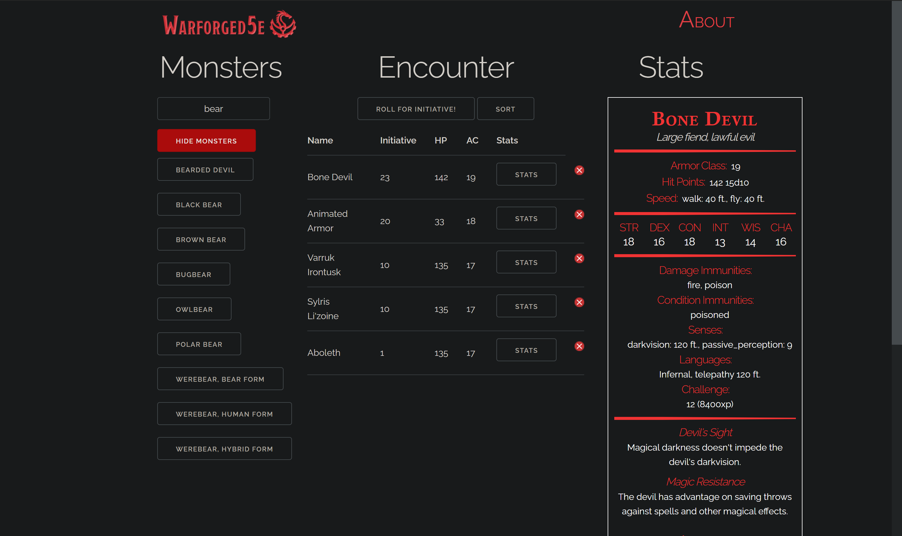

 
  

  &#xa0;

  <h1><a href="https://warforged5e.com">Click to go to webapp!</a></h1>

<h1 align="center">Warforged5e</h1>

  

  

  

  <!--  -->

  <!--  -->

  <!--  -->

<!-- Status -->

<!-- <h4 align="center"> 
	🚧  Warforged5e 🚀 Under construction...  🚧
</h4> 

 -->

  <a href="#dart-about">About</a> &#xa0; | &#xa0; 
  <a href="#sparkles-features">Features</a> &#xa0; | &#xa0;
  <a href="#rocket-technologies">Technologies</a> &#xa0; | &#xa0;
  <a href="#memo-license">License</a> &#xa0; | &#xa0;
  <a href="https://github.com/cort-robinson" target="_blank">Author - Cort Robinson</a> &#xa0; | &#xa0;
  <a href="https://github.com/jhs1790" target="_blank">Author - Jacob Scott</a>

 

## :dart: About ##

Warforged5e is a tool made for dungeon masters, by dungeon masters. Starting is as easy as pulling it up, with no complicated organization trees or button combos. If you want to speed up the logistics of your table so your players can get to slaying the monsters, wooing the damsels, and saving the kingdom (or murderhoboing, whichever is their fancy) then Warfoged5e is what you’re looking for.

Wizards of the Coast provide wonderful support for their games with manuals, guides, and supplementary materials seemingly falling from the sky… for a price. Even if the dungeon master acquires all of this material it can be difficult to pull it all together to build a coherent encounter. With Warforged5e, this presents no issue, as all official monsters are present in a simple, alphabetical list, ready to be brought forth to end the career of your prospective heroes. Once the battle is started, the basic stats for these monsters are at your fingertips, so no need to flip through the source books or look them up on the wiki.

"Roll for initiative!" - A classic turn of phrase for the dungeon master to announce combat, but instead of heralding a bout of heart pumping action, generally it announces a break as the dungeon master rolls initiative for all of his monsters and creates a turn order so his player can slot in. With Warforged5e, this ten minute or so chore becomes as simple as a few easy clicks!

## :sparkles: Features ##

:heavy_check_mark: Automated Initiative Rolls;\
:heavy_check_mark: Easy Statblock Reference;\
:heavy_check_mark: Manual Stat Overrides;

## :rocket: Technologies ##

The following tools were used in this project:

- [dnd5eapi.co](http://dnd5eapi.co/)
- [Skeleton](https://nodejs.org/en/)
- [jQuery](https://jquery.com/)

## About the Authors ##

Cort Robinson:
  Growing up in a military family, Cort has travelled all around the US. Throughout that time he developed a love and passion for technology and computer science. As a student at Holberton school of Computer Science, Cort has developed skills across a wide range of technologies and is always excited to expand his knowledge in to new areas.
  
Jacob Scott:
  World traveller and beard extraordinair, Jacob is excited to bring all of his experiences to the software development space and make a mark in the creative gaming industy. With a degree and military history his interests naturally focus on this area, but his love of storytelling and good worksmanship in the space attracts his interests in many diverse projects. 

## :memo: License ##

This project is under license from MIT. For more details, see the [LICENSE](LICENSE.md) file.

Made with :heart: by <a href="https://github.com/cort-robinson" target="_blank">Cort Robinson</a> and <a href="https://github.com/jhs1790" target="_blank">Jacob Scott</a>

* **Cort Robinson** - [GitHub](https://github.com/cort-robinson), [Twitter](https://twitter.com/cort_robinson), [LinkedIn](https://www.linkedin.com/in/cort-robinson-4201b41a9/)
* **Jacob Scott** - [GitHub](https://github.com/jhs1790)

&#xa0;

<a href="#top">Back to top</a>
